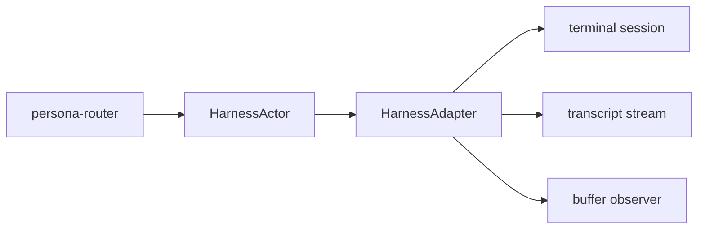

# Persona Harness Architecture

`persona-harness` models interactive coding harnesses as addressable runtime
objects.

The repository is deliberately below routing policy. It should expose what a
harness can do and what it observed, not decide global message flow.
