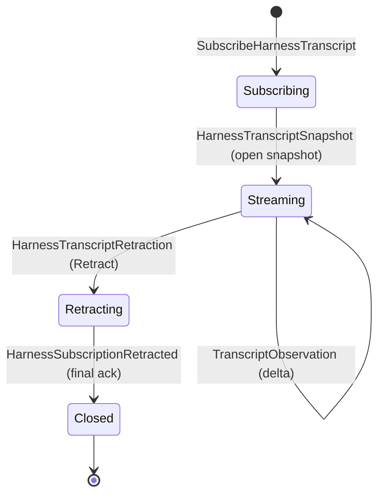

# persona-harness — architecture

*Harness identity, lifecycle, transcript, and adapter contracts.*

`persona-harness` models interactive AI harnesses as addressable runtime
objects. `HarnessKind` is the closed four-variant schema — production
variants `Codex`, `Claude`, `Pi`, and the explicit `Fixture` variant for
test harnesses. Later production harnesses become explicit variants, not
`Other { name }` string payloads. Harnesses carry lifecycle state, typed
transcript observations, sequence pointers, and delivery capabilities.

The Persona-facing terminal contract is `signal-persona-terminal`. The
destination shape for harness → terminal delivery is a typed
`signal-persona-terminal` request/reply exchanged as a length-prefixed
Signal frame on the terminal supervisor socket. Transitional: the
harness runtime currently calls the `persona-terminal` library adapter
in-process; the wire form replaces that adapter without changing the
typed contract surface.

Transcript and worker-lifecycle observations are pushed as typed events
over the harness observation channel defined by `signal-persona-harness`.
Subscribers receive `TranscriptEvent` and lifecycle-transition frames as
they happen; observation flow is push, never poll. Transitional: the
runtime's internal `transcript_event_count` is a sequencing counter, not
the observation surface; the typed observation stream is.

> **Scope.** Any "sema" reference here means today's `sema` library
> (rename pending → `sema-db`). The eventual `Sema` is broader;
> today's persona-harness is a realization step. See
> `~/primary/ESSENCE.md` §"Today and eventually".

---

## 0 · TL;DR

This repo owns the harness abstraction. It does not own routing policy,
OS-specific focus observation, or terminal durable PTY transport.

```mermaid
flowchart LR
    "persona-router" -->|"delivery request"| "Harness"
    "Harness" -->|"adapter command"| "HarnessAdapter"
    "HarnessAdapter" -->|"terminal transport"| "persona-terminal"
    "Harness" -->|"typed observation + sequence pointer"| "persona-router"
    "Harness" -->|"harness-owned state"| "harness Sema"
```

## 1 · Component Surface

`persona-harness` exposes:

- a `persona-harness-daemon` skeleton binary for the first-stack engine
  supervision witness;
- harness identity records;
- lifecycle state;
- transcript events;
- adapter capability records;
- terminal delivery adapter records;
- a Kameo harness actor surface for the assembled runtime;
- test fixtures for fake harnesses.

The only endpoint that may complete without sending bytes to terminal
transport is `FixtureOnlyHuman`. It is a fixture endpoint, not production
delivery. Production terminal delivery uses the `persona-terminal` transport
binding and counts an input as delivered only after
`TerminalEvent::TerminalInputAccepted`.

## 1.5 · Lifecycle FSM and supervision-relation reception

The harness daemon answers `signal-persona::SupervisionRequest` from a
canonical `SupervisionPhase` Kameo actor. The daemon receives exactly one
startup argument: a `signal_persona_harness::HarnessDaemonConfiguration`
record supplied as inline NOTA, a `.nota` path, or a signal-encoded `.rkyv`
path. That record carries the harness socket path and mode, supervision socket
path and mode, harness name, `HarnessKind`, optional terminal socket, and owner
identity.

`HarnessKind` is not argv state. The daemon takes it from
`HarnessDaemonConfiguration::harness_kind`, preserving the closed enum while
keeping process startup inside the workspace single-argument rule.

**Harness lifecycle FSM** (closed enum):

```text
HarnessLifecycle
  | Starting     -- spawned, awaiting first ready signal
  | Running      -- ready to accept MessageDelivery
  | Paused       -- temporarily suspended (no new deliveries; in-flight complete)
  | Stopped      -- exited (clean or crash; distinguishable via exit_code)
```

Readiness mapping for `SupervisionRequest::ComponentReadinessQuery`:

- `Running` and `Paused` → `ComponentReady { component_started_at }`
- `Starting` and `Stopped` → `ComponentNotReady { reason }`

Unbuilt domain operations reply
`HarnessEvent::HarnessRequestUnimplemented` rather than panicking or
printing untyped text.

## 1.6 · Transcript-observation subscription delivery

The harness is the destination push primitive for its own transcript
state. The subscription contract is `signal-persona-harness`'s
`HarnessTranscriptStream` (Subscribe → typed snapshot → typed deltas
→ typed Retract → typed final ack → end). The runtime side owns the
producer plane.

Three named actors carry the producer side:

| Actor | Owns |
|---|---|
| `TranscriptSubscriptionManager` | The set of open subscriptions: per-token handler reference, registration metadata, ingress count. Routes `SubscribeHarnessTranscript` and `HarnessTranscriptRetraction` to handlers. |
| `TranscriptStreamingReplyHandler` | One per open subscription. Holds the connection, the per-stream `HarnessTranscriptToken`, the sequence cursor, the local outbound buffer, and the close-ack flag. Receives `DeliverTranscriptDelta` from the publisher; writes the event onto the wire. |
| `TranscriptDeltaPublisher` | The fanout plane. Receives `TranscriptObservation` records from the `Harness` runtime; sends `DeliverTranscriptDelta { observation }` to every registered handler. |

The publisher fans out by in-process Kameo mailbox sends; the
manager → handler edge is also a mailbox send. No shared
`Arc<Mutex<…>>` carries the subscription set; each handler's mailbox
IS its per-consumer queue, and one slow handler stalls only its own
mailbox.

The full canonical five-state lifecycle (per
`~/primary/skills/subscription-lifecycle.md`):



## 2 · State and Ownership

The harness component owns live harness identity and lifecycle state.
Transcript and lifecycle events are typed observations. Normal fanout carries
typed observations plus sequence pointers, not broad raw transcript bytes.
`Harness` is the mailbox-backed owner for one live harness binding, its
lifecycle state, and its transcript event count.

Harness identity views are read-path projections: `Full`, `Redacted`, or
`Hidden`. The current code names the local view selector
`HarnessIdentityView`. It is not an authorization gate. Raw transcript
access stays behind explicit later range queries; `HarnessKind` is a
closed enum. Runtime permission lives in filesystem ACLs plus router
channel state choreographed by mind.

When durable harness history is needed, the harness actor opens its **own**
redb file (e.g. `harness.redb`) through a harness-owned Sema layer over the
workspace's `sema` database library. The harness actor sequences its own
writes; no shared cross-component database.

## 3 · Boundaries

This repo owns:

- harness domain types;
- read-path harness identity projections;
- harness actor lifecycle;
- transcript event shape;
- adapter contracts.
- harness-owned terminal delivery adaptation.

This repo does not own:

- routing decisions (`persona-router`);
- OS/window focus backend (`persona-system`);
- PTY byte transport (`persona-terminal`);
- harness wire contract definitions (`signal-persona-harness`);
- terminal wire contract definitions (`signal-persona-terminal`);
- the top-level engine-manager contract (`signal-persona`);
- database write ownership for other components' Sema layers.

## 4 · Invariants

- Harnesses are first-class records.
- Harness identity has an explicit visibility axis; redaction is typed, not a
  string filter.
- A closed viewer does not imply a killed harness.
- Transcript and lifecycle observations are pushed events.
- Transcript observation is push, not poll. Internal event count is not the
  observation surface; the typed observation stream is.
- Live harness lifecycle and transcript state belongs inside Kameo actors.
- Adapter capabilities are explicit typed records, not stringly flags.
- Fixture-only terminal endpoints cannot claim real terminal delivery.
- The daemon accepts length-prefixed `signal-persona-harness` frames.
- The daemon applies the managed spawn-envelope socket mode to `harness.sock`
  before accepting client traffic.
- The daemon turns `MessageDelivery` into terminal input only when a typed
  terminal endpoint was provided by its spawn envelope or CLI.
- The daemon reports `DeliveryCompleted` only after terminal transport accepts
  the input bytes.
- The daemon reports typed `DeliveryFailed` when no terminal endpoint is
  available.
- The daemon answers `HarnessStatusQuery` with typed health and readiness.
- The daemon returns `HarnessRequestUnimplemented` for valid contract
  operations that are not built yet.
- The daemon does not print untyped text errors for recognized unfinished
  operations.
- The daemon accepts `SubscribeHarnessTranscript`, replies with a typed
  `HarnessTranscriptSnapshot` carrying the per-stream token and the
  current sequence pointer, then pushes `TranscriptObservation` events
  as transcript lines become visible.
- Each open transcript subscription is owned by a per-subscription
  `TranscriptStreamingReplyHandler` actor; a slow consumer holds back
  its own stream and cannot block siblings.
- The daemon accepts `HarnessTranscriptRetraction` for an open
  subscription, drains the in-flight delta queue, emits the final
  `HarnessSubscriptionRetracted` reply carrying the same token, and
  closes the stream.
- The handler's outbound delta buffer is bounded; on overrun the
  subscription drops with a typed failure reply rather than overrunning
  the consumer.
- Transcript deltas carry a strictly-increasing `HarnessTranscriptSequence`.

## Code Map

```text
src/harness.rs    harness identity records
src/daemon.rs     length-prefixed Signal daemon skeleton
src/runtime.rs    Kameo lifecycle and transcript state owner
src/terminal.rs   terminal delivery adapter records
src/transcript.rs transcript event records
tests/            harness smoke and actor-runtime constraint tests
```

## Constraint Tests

| Constraint | Test |
|---|---|
| Harness identity projection keeps full, redacted, and hidden views distinct. | `nix flake check .#harness-identity-projection-views` |
| Harness identity projection cannot collapse back to one always-full record. | `nix flake check .#harness-identity-projection-source-constraint` |
| Fixture-only human terminal endpoints cannot claim production delivery. | `nix flake check .#terminal-fixture-endpoint-not-production-delivery` |
| `HarnessKind` has exactly four variants and no fifth. | `nix flake check .#harness-kind-includes-all-four-variants` |
| `HarnessKind` has no command-line argument projection table. | `nix flake check .#harness-kind-has-no-command-line-argument-projection` |
| Harness daemon accepts `HarnessKind::Fixture` from a single NOTA configuration argument. | `nix flake check .#harness-daemon-accepts-fixture-kind-from-single-nota-configuration-argument` |
| Harness daemon accepts `HarnessKind::Codex` from a single NOTA configuration argument. | `nix flake check .#harness-daemon-accepts-codex-kind-from-single-nota-configuration-argument` |
| Harness daemon rejects multiple configuration arguments before daemon construction. | `nix flake check .#harness-daemon-configuration-rejects-multiple-arguments` |
| Harness daemon applies the managed spawn-envelope socket mode. | `nix flake check .#harness-daemon-applies-spawn-envelope-socket-mode` |
| Harness daemon flows distinctive socket modes through to both the domain and supervision sockets. | `nix flake check .#harness-daemon-applies-distinctive-spawn-envelope-socket-modes` |
| Harness daemon delivers message bytes to a configured terminal endpoint. | `nix flake check .#harness-daemon-delivers-message-to-terminal-endpoint` |
| Harness daemon rejects message delivery without a terminal endpoint. | `nix flake check .#harness-daemon-rejects-message-delivery-without-terminal-endpoint` |
| Harness daemon answers status/readiness through its Signal boundary. | `nix flake check .#harness-daemon-answers-status-readiness` |
| Harness daemon returns typed unimplemented for valid unfinished requests. | `nix flake check .#harness-daemon-returns-typed-unimplemented` |
| Harness daemon opens a transcript subscription, returns a typed snapshot, and pushes typed deltas. | `nix flake check .#harness-daemon-pushes-transcript-deltas-after-subscribe` |
| A subscriber receives the final `HarnessSubscriptionRetracted` ack carrying the same token before the stream ends. | `nix flake check .#harness-daemon-emits-final-subscription-retracted-ack` |
| A slow subscriber does not stall transcript-delta delivery to a sibling subscription. | `nix flake check .#harness-daemon-slow-subscriber-does-not-block-siblings` |

## See Also

- `~/primary/skills/subscription-lifecycle.md` — canonical
  five-state FSM the transcript subscription implements.

- `../persona-router/ARCHITECTURE.md`
- `../persona-system/ARCHITECTURE.md`
- `../persona-terminal/ARCHITECTURE.md`
- `../sema/ARCHITECTURE.md`
- `../signal-persona-harness/ARCHITECTURE.md`
