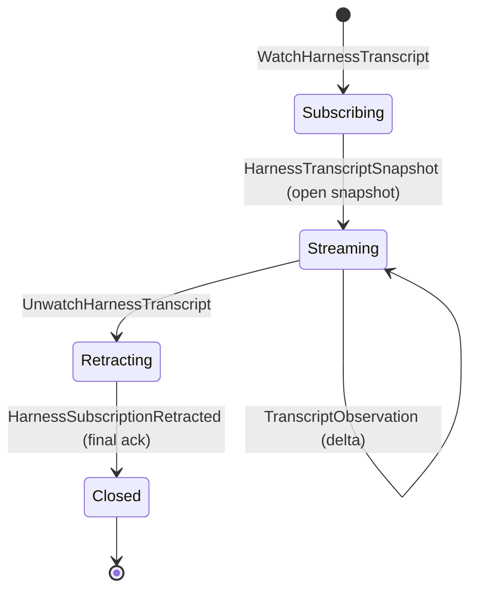

# harness — architecture

*Harness identity, lifecycle, transcript, and adapter contracts.*

`harness` models interactive AI harnesses as addressable runtime
objects. It owns the reusable abstraction for Codex, Claude, and Pi
harnesses; it does not own routing policy, OS/window focus observation,
or terminal PTY byte transport. Today's harness is a realization step on
the eventually-self-hosting stack, built rightly for the scope it serves
now. `HarnessKind` is the closed four-variant schema — production
variants `Codex`, `Claude`, `Pi`, and the explicit `Fixture` variant for
test harnesses. Later production harnesses become explicit variants, not
`Other { name }` string payloads. Harnesses carry lifecycle state, typed
transcript observations, sequence pointers, and delivery capabilities.

The Persona-facing terminal contract is `signal-terminal`. The
destination shape for harness → terminal delivery is a typed
`signal-terminal` request/reply exchanged as a length-prefixed
Signal frame on the terminal signal socket. The harness runtime
writes the generated `TerminalFrame` directly; it does not depend on the
retired in-process `terminal` helper crate.

The Pi-facing intake contract is Pi RPC/JSONL over stdio. A Pi-kind
harness instance may be launched with a typed
`PiRpcJsonlAdapterConfiguration` in its
`HarnessInstanceConfiguration`; the daemon then owns a long-lived
`pi --mode rpc` process for that instance and converts routed
`MessageDelivery` records into the configured `prompt`, `steer`, or
`follow_up` JSONL command. Delivery completes only when Pi emits the
matching successful JSONL response.

Transcript and worker-lifecycle observations are pushed as typed events
over the harness observation channel defined by `signal-harness`.
Subscribers receive `TranscriptEvent` and lifecycle-transition frames as
they happen; observation flow is push, never poll. Transitional: the
runtime's internal `transcript_event_count` is a sequencing counter, not
the observation surface; the typed observation stream is.

> **Scope.** Harness does not yet need durable history, but when it does the
> component-owned store is `harness.sema` opened through `sema-engine`; the
> daemon does not touch raw redb or another component's store.

## 0 · TL;DR

This repo owns the harness abstraction. It does not own routing policy,
OS-specific focus observation, or terminal durable PTY transport.

```mermaid
flowchart LR
    "router" -->|"delivery request"| "Harness"
    "Harness" -->|"adapter command"| "HarnessAdapter"
    "HarnessAdapter" -->|"TerminalFrame"| "signal-terminal"
    "HarnessAdapter" -->|"Pi RPC JSONL"| "pi --mode rpc"
    "Harness" -->|"typed observation + sequence pointer"| "router"
    "Harness" -->|"harness-owned state"| "harness Sema"
```

## 1 · Component Surface

`harness` exposes:

- `harness`, the ordinary thin CLI client for `signal-harness`: one inline
  Datom `Query` argument, one Datom `Response` printed;
- `meta-harness`, the owner/meta thin CLI client for
  `meta-signal-harness`, of the same one-argument Datom shape;
- `harness-usage`, the human view of one usage snapshot: it sends
  `UsageSnapshotQuery` and prints each window's remaining share, time left,
  local reset and the rate to use the remainder by that reset;
- `harness-daemon`, the managed runtime daemon that binds the ordinary,
  owner-only meta and supervision sockets from a single binary startup
  record;
- `harness-daemon-launch`, the user-service launcher: it takes no argument,
  writes the typed startup record for its systemd `RUNTIME_DIRECTORY` and its
  own uid (three `0600` sockets there, an empty instance set), and replaces
  itself with `harness-daemon`;
- `flow-id`, the parent-only filesystem claim CLI for one shared flow alias:
  Codex claims normalized UUID characters `[23:29]`, while Claude claims the
  first six literal hexadecimal characters of a canonical lowercase UUIDv4 or
  UUIDv5 parent session with RFC 4122 variant. Claude markers retain that UUID
  version, while deployed untyped v4 markers stay compatible. Both use a stable
  private lock and complete-or-absent marker publication;
- harness identity records;
- lifecycle state;
- transcript events;
- adapter capability records;
- terminal delivery adapter records;
- Pi RPC/JSONL delivery adapter records;
- a Kameo harness actor surface for the assembled runtime;
- test fixtures for fake harnesses.

The only endpoint that may complete without sending bytes to terminal
transport is `FixtureOnlyHuman`. It is a fixture endpoint, not production
delivery. Production terminal delivery uses the `signal-terminal`
contract and counts an input as delivered only after
`TerminalReply::TerminalInputAccepted`. Pi RPC delivery counts as delivered
only after the configured RPC command is accepted by the Pi JSONL response
stream.

## 1.5 · Lifecycle FSM and supervision-relation reception

Every socket carries one contract, one `signal` frame per value: a
four-byte big-endian length and the rkyv archive of the contract root, with
no envelope, exchange identifier or contract discriminator. The ordinary
socket carries `signal-harness` `Query` and `Response`; on a watch connection
every later frame is a `Response`, stream events riding
`Response::HarnessTranscriptEvent` with their subscription token. The
owner-only meta socket (bound at `0o600` by the daemon shape) carries
`meta-signal-harness`; its `Configure` is not built yet and replies with a
typed `RequestUnimplemented`. The supervision socket, bound by the engine
with its configured mode, carries the `signal-persona` engine-management
lifecycle and answers announce, readiness, health and stop. Meta and
supervision never share a socket, because a frame does not say which
contract it holds.

The daemon receives exactly one startup argument: a
`signal_harness::HarnessDaemonConfiguration` record supplied as a
signal-encoded/rkyv file path. Inline text startup files are rejected before
daemon-specific decoding. That record carries the ordinary, meta and
supervision socket paths and modes, owner identity, and a list of typed
`HarnessInstanceConfiguration` records. Each instance record carries the
harness name, `HarnessKind`, optional terminal socket, and optional
`PiRpcJsonlAdapterConfiguration` that starts the programmatic Pi intake
process for that harness.

`HarnessKind` is not argv state. The daemon takes it from each
`HarnessInstanceConfiguration::harness_kind`, preserving the closed enum
while keeping process startup inside the workspace single-argument rule.
One `harness-daemon` process may own multiple harness instances; those
boundaries are in-process actors/adapters unless a future deployment
requires process isolation.

The meta surface handles `ResolveModel(ModelResolutionRequest)`
in `harness`, not in orchestrate or a `meta-*` crate. The runtime resolves
an exact model selector or a named capability profile against the configured
harness adapters, returns `ModelResolved` with the chosen harness, closed
`HarnessKind`, provider model, effort, and typed `ContinuationHandle`, or
returns `ModelUnavailable` with the narrow reason it can prove. Pi exact
resolution is driven by the configured `PiRpcJsonlAdapterConfiguration`
model pattern; Pi capability profiles `pi` and `local` select that configured
model. Claude and Codex use harness-owned provider namespaces for their
known model/profile names, and still require a configured terminal adapter.
`ContinuationRequest::Require` accepts only a provider-matching valid handle.
`ContinuationRequest::Prefer` is deliberately not a silent fallback: an
invalid or wrong-provider handle returns `ContinuationUnavailable`, so the
orchestrator can explicitly retry with `Fresh` if that is its policy.

**Harness lifecycle FSM** (closed enum):

```text
HarnessLifecycle
  | Starting     -- spawned, awaiting first ready signal
  | Running      -- ready to accept MessageDelivery
  | Paused       -- temporarily suspended (no new deliveries; in-flight complete)
  | Stopped      -- exited (clean or crash; distinguishable via exit_code)
```

Readiness mapping for `Operation::Query(ReadinessStatus)`:

- `Running` and `Paused` → `ComponentReady { component_started_at }`
- `Starting` and `Stopped` → `ComponentNotReady { reason }`

Unbuilt domain operations reply
`HarnessEvent::HarnessRequestUnimplemented` rather than panicking or
printing untyped text.

## 1.6 · Transcript-observation subscription delivery

The harness is the destination push primitive for its own transcript
state. The subscription contract is `signal-harness`'s
`HarnessTranscriptStream` (Watch → typed snapshot → typed deltas
→ typed Unwatch → typed final ack → end). The runtime side owns the
producer plane.

Three named actors carry the producer side:

| Actor | Owns |
|---|---|
| `TranscriptSubscriptionManager` | The set of open subscriptions: per-token handler reference, registration metadata, ingress count. Routes `WatchHarnessTranscript` and `UnwatchHarnessTranscript` to handlers. |
| `TranscriptStreamingReplyHandler` | One per open subscription. Holds the connection, the per-stream `HarnessTranscriptToken`, the sequence cursor, the local outbound buffer, and the close-ack flag. Receives `DeliverTranscriptDelta` from the publisher; writes the event onto the wire. |
| `TranscriptDeltaPublisher` | The fanout plane. Receives `TranscriptObservation` records from the `Harness` runtime; sends `DeliverTranscriptDelta { observation }` to every registered handler. |

The publisher fans out by in-process Kameo mailbox sends; the
manager → handler edge is also a mailbox send. No shared
`Arc<Mutex<…>>` carries the subscription set; each handler's mailbox
IS its per-consumer queue, and one slow handler stalls only its own
mailbox.

The full canonical five-state lifecycle (per
`~/primary/skills/subscription-lifecycle.md`):


```mermaid
stateDiagram-v2
    [*] --> Subscribing : WatchHarnessTranscript
    Subscribing --> Streaming : HarnessTranscriptSnapshot (open snapshot)
    Streaming --> Streaming : TranscriptObservation (delta)
    Streaming --> Retracting : UnwatchHarnessTranscript
    Retracting --> Closed : HarnessSubscriptionRetracted (final ack)
    Closed --> [*]
```

## 1.7 · Subscription-usage snapshot

`UsageSnapshotQuery` is answered at daemon scope, before any configured
instance is looked up, so it needs no harness instance and launches no model
session; the daemon may run with an empty instance set. `src/usage/` reads one
fresh, read-only `UsageSnapshot`: every Claude and Codex subscription's quota
limits and windows, and every live session's context. It is paced by
invocation; it has no watch, timer, store, ledger or token refresh. The read
runs off the async runtime and the daemon user's own `HOME`.

- Claude quota: the module reads `~/.claude/.credentials.json`, refuses an
  expiring token (`AccessTokenExpired`, never refreshed), and calls the fixed
  OAuth usage endpoint with the token only in the `Authorization` header.
  The named top-level windows (`five_hour`, `seven_day`) and every `limits[]`
  entry are each enumerated; only a named window carries a duration, never
  one inferred from a shared reset time.
- Codex quota: every `~/.codex*` home with a login is asked through its own
  app-server control socket (WebSocket over Unix, `initialize` then
  `account/rateLimits/read`); homes answering for one account are one
  subscription, and every limit id and server-declared window is kept.
- Percentages are shares only from 0 to 100; anything else is an unreadable
  window, never clamped. A passed reset leaves the window's values stale.
- Each window carries its reset countdown and local reset (in the host's
  configured zone) as its own state, and three separate derivations: the
  rate to use the remainder by the reset (`r / T`, needing no duration), the
  uniform rate over a known duration, and the elapsed position of a fixed
  period (unavailable: neither provider establishes fixed-period semantics).
  The planning projection is `NotConfigured`.
- Auxiliary allowance, credit and spend/control facts are named as unmodeled
  source facts, never made quota windows.
- Context: live Claude sessions from `~/.claude/sessions/<pid>.json` and the
  transcript tail's last request (a proxy; percentage unknown without a
  status-line snapshot); loaded Codex threads from `thread/loaded/list`,
  `thread/read` and the rollout's last `token_count`. Superseded and unbound
  states are kept. No Flow identifier is derived from a session name or id.
- Every read is bounded in bytes and time. Every attempted provider, home
  and context collector appears in the reply: a failure is a typed
  unavailable result with its time and cause, a collector that failed
  outright is `CollectorFailed`, and one provider's failure never removes the
  other's result.

## 2 · State and Ownership

The harness component owns live harness identity and lifecycle state.
Transcript and lifecycle events are typed observations. Normal fanout carries
typed observations plus sequence pointers, not broad raw transcript bytes.
`Harness` is the mailbox-backed owner for one live harness binding, its
lifecycle state, and its transcript event count.

Harness identity views are read-path projections: `Full`, `Redacted`, or
`Hidden`. The current code names the local view selector
`HarnessIdentityView`. It is not an authorization gate. Raw transcript
access stays behind explicit later range queries; `HarnessKind` is a
closed enum. Runtime permission lives in filesystem ACLs plus router
channel state choreographed by mind.

When durable harness history is needed, the harness actor opens its **own**
harness Sema file (e.g. `harness.sema`) through a harness-owned Sema layer
backed by `sema-engine`. The harness actor sequences its own writes; no shared
cross-component database.

Per archived intent `hqg7`, the production shape is **one component daemon
owning multiple harness instances internally** — one OS daemon per harness is
too heavy for the intended design. Per-harness boundaries live as
records/actors/adapters inside the harness daemon (one `Harness` mailbox-backed
actor per live binding), not as separate component processes. The
message-routing end-to-end witness reflects this: a single `harness-daemon`
process owns both harness instances in the round trip.

## 3 · Boundaries

This repo owns:

- harness domain types;
- read-path harness identity projections;
- harness actor lifecycle;
- transcript event shape;
- adapter contracts.
- harness-owned terminal delivery adaptation.
- harness-owned Pi RPC/JSONL delivery adaptation.

This repo does not own:

- routing decisions (`router`);
- OS/window focus backend (`system`);
- PTY byte transport (`terminal`);
- harness wire contract definitions (`signal-harness`);
- terminal wire contract definitions (`signal-terminal`);
- the top-level engine-management contract (`signal-engine-management`);
- Pi's internal model/runtime implementation;
- database write ownership for other components' Sema layers.

### 3.1 · Reliability and browser-automation notes (archived intent)

- **Compaction-abort reliability (`eo25`).** Pi harness aborts around
  compaction are a recurring reliability problem, not isolated one-offs.
  Future investigations should treat stop-after-compaction symptoms as harness
  bug candidates unless a user or manual abort is confirmed.
- **Browser-automation attach-to-visible-tab (`s8lq`).** Browser automation for
  real user accounts should support attaching to a visible browser tab/session
  so the human can watch, intervene, and keep login/2FA secrets out of agent
  prompts and logs.

## 4 · Invariants

- Harnesses are first-class records.
- Harness identity has an explicit visibility axis; redaction is typed, not a
  string filter.
- A closed viewer does not imply a killed harness.
- Transcript and lifecycle observations are pushed events.
- Transcript observation is push, not poll. Internal event count is not the
  observation surface; the typed observation stream is.
- Live harness lifecycle and transcript state belongs inside Kameo actors.
- Adapter capabilities are explicit typed records, not stringly flags.
- Fixture-only terminal endpoints cannot claim real terminal delivery.
- Each daemon socket carries exactly one contract's plain `signal` frames.
- The `harness` CLI sends one ordinary `signal-harness` request from one
  inline Datom argument and prints one Datom reply.
- The `meta-harness` CLI sends one privileged `meta-signal-harness` request
  from one inline Datom argument and prints one Datom reply.
- `harness-usage` takes no argument, sends `UsageSnapshotQuery`, and prints
  the human view.
- `UsageSnapshotQuery` is answered before any instance lookup.
- The daemon applies the managed spawn-envelope socket mode to `harness.sock`
  before accepting client traffic.
- The daemon turns `MessageDelivery` into terminal input only when a typed
  terminal endpoint was provided by its spawn envelope or CLI.
- The daemon reports `DeliveryCompleted` only after terminal transport accepts
  the input bytes.
- The daemon reports `DeliveryCompleted` for Pi only after the Pi RPC process
  emits a successful matching JSONL response for the configured delivery
  command.
- The daemon reports typed `DeliveryFailed` when no adapter endpoint is
  available.
- The message-routing e2e witness is a round-trip only when a real first
  `message` CLI call reaches another harness through real `message-daemon`,
  `router-daemon`, and one `harness-daemon` process owning both harness
  instances, the receiving endpoint sends a reply through its own real
  `message` CLI and message daemon, and the first harness receives that
  response.
- The daemon answers `HarnessStatusQuery` with typed health and readiness.
- The daemon returns `HarnessRequestUnimplemented` for valid contract
  operations that are not built yet.
- The daemon does not print untyped text errors for recognized unfinished
  operations.
- The daemon accepts `WatchHarnessTranscript`, replies with a typed
  `HarnessTranscriptSnapshot` carrying the per-stream token and the
  current sequence pointer, then pushes `TranscriptObservation` events
  as transcript lines become visible.
- Each open transcript subscription is owned by a per-subscription
  `TranscriptStreamingReplyHandler` actor; a slow consumer holds back
  its own stream and cannot block siblings.
- The daemon accepts `UnwatchHarnessTranscript` for an open
  subscription, drains the in-flight delta queue, emits the final
  `HarnessSubscriptionRetracted` reply carrying the same token, and
  closes the stream.
- The handler's outbound delta buffer is bounded; on overrun the
  subscription drops with a typed failure reply rather than overrunning
  the consumer.
- Transcript deltas carry a strictly-increasing `HarnessTranscriptSequence`.

## 5 · Consumers on older contracts

Persona (both the lowercase persona checkout, including branch f6db8d-arity-front, and uppercase Persona) and Mentci (pinned in CriomOS-home at a1eb5e2) still build against pre-8.0.0 signal-harness; neither is selected by Home for the harness service; Mentci builds Harness types in-process and never talks to the daemon; migrating them is deferred until either is selected; nothing claims they are compatible with signal-harness 8.0.0.

## Code Map

```text
src/main.rs               ordinary signal-harness CLI
src/bin/meta_harness.rs   meta-signal-harness CLI
src/bin/harness_daemon.rs managed daemon entrypoint
src/bin/flow_id.rs        parent-flow identity claim CLI
src/flow_id.rs            harness-specific UUID validation and atomic lane claim protocol
src/client.rs             ordinary CLI client transport
src/meta.rs               meta CLI client transport
src/configuration.rs      BindingSurface over HarnessDaemonConfiguration
src/daemon.rs             length-prefixed Signal daemon hooks
src/harness.rs            harness identity records
src/runtime.rs            Kameo lifecycle and transcript state owner
src/terminal.rs           terminal delivery adapter records
src/pi.rs                 Pi RPC/JSONL process adapter
src/transcript.rs         transcript event records
src/usage/                one-shot subscription-usage snapshot (quota and context) and its human view
src/wire.rs               the plain Signal frame every socket speaks
src/bin/harness_usage.rs  the harness-usage human-view client
src/launch_user.rs        the user-service launcher's typed configuration
tests/                    harness smoke, daemon, CLI, and actor-runtime tests
```

## Constraint Tests

| Constraint | Test |
|---|---|
| Harness identity projection keeps full, redacted, and hidden views distinct. | `nix flake check .#harness-identity-projection-views` |
| The Claude usage token reaches only the `Authorization` header and no reply. | `nix flake check .#usage-claude-token-only-in-header` |
| An expired Claude token is reported and never sent. | `nix flake check .#usage-claude-expired-token-never-sent` |
| Same-account Codex homes are one subscription; other homes fail per home. | `nix flake check .#usage-codex-same-account-homes-deduplicated` |
| One provider's failure never removes the other's snapshot result. | `nix flake check .#usage-provider-failure-isolated` |
| The countdown is its own state; a known reset keeps its rate without a duration. | `nix build .#checks.<system>.usage-countdown-own-state`; `nix build .#checks.<system>.usage-no-duration-inferred-from-reset` |
| A passed reset leaves stale values and divides nothing; a full share has a zero rate. | `nix build .#checks.<system>.usage-reset-at-observation-passed`; `nix build .#checks.<system>.usage-full-share-zero-rate` |
| Percentages outside 0 to 100 are unreadable, never clamped. | `nix build .#checks.<system>.usage-percent-domain` |
| Rates round toward zero; the weekly uniform rate is 100/7 percent a day. | `nix build .#checks.<system>.usage-rate-rounding` |
| The elapsed position needs fixed-period semantics. | `nix build .#checks.<system>.usage-elapsed-needs-fixed-period` |
| Auxiliary allowance and spend facts are named, never windows. | `nix build .#checks.<system>.usage-claude-auxiliary-facts-named`; `nix build .#checks.<system>.usage-codex-every-limit-window-and-fact` |
| Every attempted context source and collector reports its failure. | `nix build .#checks.<system>.usage-codex-context-source-failures`; `nix build .#checks.<system>.usage-claude-registry-failures`; `nix build .#checks.<system>.usage-collector-failed` |
| The daemon answers the usage query with no configured instance; both clients print it in one call. | `nix build .#checks.<system>.usage-daemon-scope-without-instances`; `nix build .#checks.<system>.usage-both-clients-one-call` |
| The user-service launcher writes the owner-only empty-instance configuration and becomes the daemon; it refuses an argument or a missing runtime directory. | `nix build .#checks.<system>.usage-user-service-launcher`; `nix build .#checks.<system>.usage-launcher-refusals` |
| The human view leads with remaining, time left, local reset and the remainder rate. | `nix build .#checks.<system>.usage-cli-human-view` |
| A Codex parent claims one stable alias from its UUID and prints no other stdout. | `nix flake check .#flow-id` |
| A Claude parent claims the first six literal hex characters of its UUIDv4 or UUIDv5 parent session. | `nix flake check .#flow-id-claude` |
| Claude rejects noncanonical, unsupported-version, and invalid-variant parent sessions before claiming a lane. | `nix flake check .#flow-id-claude-validation` |
| Claude fails closed after every eligible literal candidate is occupied. | `nix flake check .#flow-id-claude-exhaustion` |
| A Claude first creator never exposes a partial marker to a concurrent claimant. | `nix flake check .#flow-id-publication-race` |
| Harness identity projection cannot collapse back to one always-full record. | `nix flake check .#harness-identity-projection-source-constraint` |
| Fixture-only human terminal endpoints cannot claim production delivery. | `nix flake check .#terminal-fixture-endpoint-not-production-delivery` |
| `HarnessKind` has exactly four variants and no fifth. | `nix flake check .#harness-kind-includes-all-four-variants` |
| `HarnessKind` has no command-line argument projection table. | `nix flake check .#harness-kind-has-no-command-line-argument-projection` |
| Harness daemon accepts `HarnessKind::Fixture` from a single binary configuration argument. | `cargo test --test daemon harness_daemon_accepts_fixture_kind_from_single_binary_configuration_argument` |
| Harness daemon accepts `HarnessKind::Codex` from a single binary configuration argument. | `cargo test --test daemon harness_daemon_accepts_codex_kind_from_single_binary_configuration_argument` |
| Harness daemon rejects multiple configuration arguments before daemon construction. | `nix flake check .#harness-daemon-configuration-rejects-multiple-arguments` |
| Harness daemon applies the configured working socket mode. | `nix flake check .#harness-daemon-binds-working-socket-with-configured-mode` |
| Harness daemon applies the configured working and supervision socket modes while keeping the meta socket owner-only by daemon shape. | `nix build .#checks.<system>.harness-daemon-applies-configured-socket-modes-and-owner-only-meta` |
| Meta and supervision are separate sockets; the supervision socket does not answer a meta request. | `nix build .#checks.<system>.harness-daemon-keeps-meta-and-supervision-on-separate-sockets` |
| Harness daemon delivers message bytes to a configured terminal endpoint. | `nix flake check .#harness-daemon-delivers-message-to-terminal-endpoint` |
| Harness daemon dispatches two harness instances inside one process by `HarnessName`. | `cargo test --test daemon harness_daemon_dispatches_two_harness_instances_inside_one_process` |
| Harness daemon delivers Pi-kind messages through the Pi RPC/JSONL adapter. | `cargo test --test daemon harness_daemon_delivers_message_to_pi_rpc_endpoint` |
| The Pi RPC adapter can accept a prompt through the low-quant Gemma 4 MoE local model when the live endpoint is available. | `HARNESS_LIVE_PI_RPC=1 HARNESS_LIVE_PI_MODEL=gemma-4-26b-a4b-ud-q4-k-xl cargo test --test pi_rpc_live -- --nocapture` |
| Harness daemon rejects message delivery without a terminal endpoint. | `nix flake check .#harness-daemon-rejects-message-delivery-without-terminal-endpoint` |
| Harness daemon answers status/readiness through its Signal boundary. | `nix flake check .#harness-daemon-answers-status-readiness` |
| Harness daemon returns typed unimplemented for valid unfinished requests. | `nix flake check .#harness-daemon-returns-typed-unimplemented` |
| Harness daemon answers the meta-harness policy contract on its meta socket. | `nix flake check .#harness-daemon-answers-meta-harness-relation` |
| Harness daemon resolves exact Pi model requests and capability/profile requests through the owner-only meta surface. | `nix build .#checks.<system>.harness-daemon-resolves-exact-pi-model-request`; `nix build .#checks.<system>.harness-daemon-resolves-capability-profile-request` |
| Harness daemon returns typed model-unavailable reasons and validates provider continuation handles at the harness boundary. | `nix build .#checks.<system>.harness-daemon-returns-typed-model-unavailable-reasons`; `nix build .#checks.<system>.harness-daemon-validates-continuation-handles-at-harness-boundary`; `nix build .#checks.<system>.harness-daemon-reports-adapter-configuration-missing-for-unlaunchable-match` |
| `harness` reaches the ordinary working socket and prints a typed reply. | `nix flake check .#harness-cli-reaches-working-socket` |
| `meta-harness` reaches the owner/meta policy socket and prints a typed reply. | `nix flake check .#meta-harness-cli-reaches-policy-socket` |
| Harness daemon opens a transcript subscription, returns a typed snapshot, and pushes typed deltas plus the final ack on the subscribed stream. | `nix build .#checks.<system>.harness-daemon-watch-transcript-stream-delivers-published-observation-and-final-ack` |
| A subscriber receives the final `HarnessSubscriptionRetracted` ack carrying the same token before the stream ends. | `nix build .#checks.<system>.harness-daemon-unwatch-transcript-returns-final-retraction-ack-on-subscribed-stream` |
| Multiple simultaneous watchers for the same harness receive independent stream frames, and closing one watcher does not close the other. | `nix build .#checks.<system>.harness-daemon-allows-nested-watchers-for-same-harness-without-cross-closing` |
| A transcript stream is bound to its first watched harness; cross-harness nested watches are rejected without creating a misrouted subscription. | `nix build .#checks.<system>.harness-daemon-rejects-cross-harness-nested-watch-without-leaking-subscription` |
| A slow subscriber does not stall transcript-delta delivery to a sibling subscription. | `cargo test --test subscription_truth slow_subscriber_does_not_block_sibling_subscription` |
| A real `message` CLI call reaches a second Pi-kind harness through real message/router daemons and one multi-instance harness daemon, the receiving endpoint replies through its own real `message` CLI and daemon, and the first harness receives the response. | `cargo test --features message-router-e2e --test message_router_harness_e2e` |

## See Also

- `~/primary/skills/subscription-lifecycle.md` — canonical
  five-state FSM the transcript subscription implements.

- `../router/ARCHITECTURE.md`
- `../system/ARCHITECTURE.md`
- `../terminal/ARCHITECTURE.md`
- `../sema/ARCHITECTURE.md`
- `../signal-harness/ARCHITECTURE.md`
